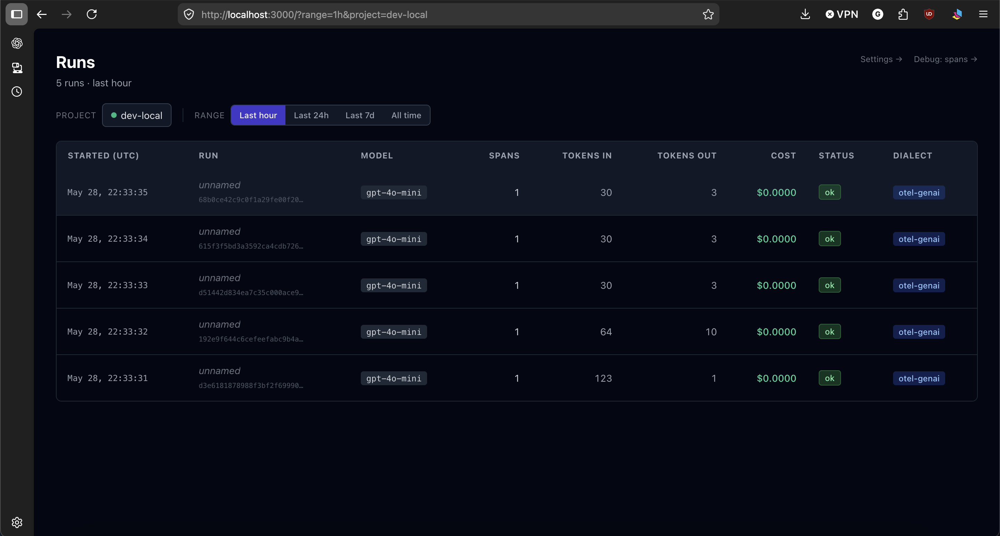
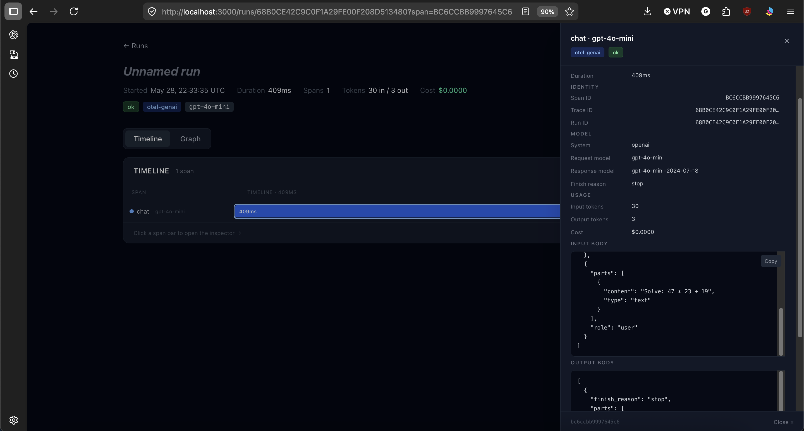
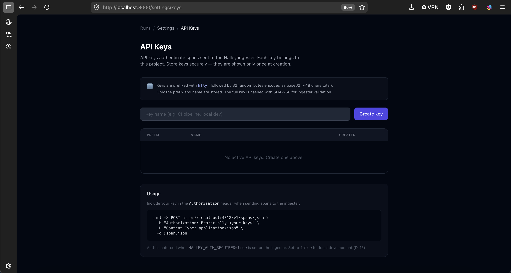

# Halley

**Your production traffic is your test suite.**

Halley turns production agent runs into deterministic, replayable regression tests. Change a prompt, upgrade a model, refactor a tool, and Halley replays your entire accumulated fixture library in CI at zero LLM cost, tells you which real customer scenarios would break, and points at the exact change that caused it.

Self-hostable. OpenTelemetry-native. Built for the era where your AI keeps changing under you.

> Status: Pre-alpha. Active development May 2026 to August 2026.
> Tracking progress in [`docs/ROADMAP.md`](docs/ROADMAP.md).

---

## The problem Halley solves

Every team shipping LLM agents hits the same three walls, usually within a month of going to production.

1. **You cannot test cheaply.** Teams report large fractions of their monthly LLM spend are dev and CI traffic hitting live APIs. Every iteration taxes the bill.
2. **You cannot reproduce bugs.** A customer says "your agent hallucinated on Tuesday." Tuesday is gone. Even if the run was captured, the model behind it has shifted since.
3. **You cannot tell when you got worse.** LLMs fail silently. A one-word prompt tweak or a provider's quiet model upgrade degrades behavior in ways no stack trace catches. Teams lose real money before anyone notices.

Existing observability tools (Langfuse, Laminar, LangSmith, Phoenix, Helicone) show the traces. None of them close the loop from "production run happened" back into "regression test our CI will catch next time."

Halley closes that loop.

---

## What Halley does

Halley is an OpenTelemetry-native observability backend with one hero capability wrapped around it.

### Record
Every production agent run becomes a **cassette**: the exact sequence of LLM calls, tool inputs, tool outputs, timing, and intermediate state. Bit-fidelity capture of raw request and response bodies, not best-effort reconstruction.

### Promote
One click on any run in the dashboard turns it into a permanent fixture in your repo's test library. Halley automatically infers invariants from the run:

- **Structural**: which tools got called, in what order, how many times.
- **Schema**: the shape of each LLM output and tool payload.
- **Metric**: latency and cost bounds.
- **Semantic**: optional LLM-as-judge for "is the new output equivalent to the recorded one."

You edit, tighten, or remove any inferred invariant before it lands in the repo.

### Replay in CI
`halley ci` replays your entire fixture library against the current code. Zero live LLM calls when the cassette matches. When a prompt changes, Halley runs in hybrid mode: tool responses stay cached, only the drifted LLM call goes live. A full failing run shows exactly which invariant broke on which fixture.

### Bisect
When a regression fires, Halley bisects across recent commits and points at the change that broke the invariant. Prompt diff, model version bump, framework upgrade, new tool version. The error message names the line.

### Audit
Every fixture is a reproducible record of what the agent did and why. For regulated industries that need to reproduce an agent decision on demand, the cassette is the audit trail.

---

## Who this is for

**Teams shipping LLM agents to production** who are tired of rediscovering the same customer bug, deploying prompt changes based on three hand-picked examples, paying for the same test inputs repeatedly, and not knowing whether today's model still handles yesterday's edge cases.

**Regulated industries** (finance, healthcare, legal) that need agent decisions to be reproducible on demand and currently cannot guarantee that.

**Open-source maintainers of agent frameworks** who want CI that proves their changes do not regress real user workflows.

---

## How Halley compares

Halley is compatible with any OTLP-emitting instrumentation, including OpenLLMetry, OpenInference, OpenTelemetry GenAI semantic conventions, Vercel AI SDK, Pydantic AI, and raw provider SDK auto-instrumentation. If your app already exports OTLP, you are most of the way to Halley.

| If you want... | Use... |
|---|---|
| Browser-agent replay and session recording | [Laminar](https://laminar.sh) |
| LangChain-native interactive debugging | LangSmith |
| A proxy that handles routing and cost tracking | Helicone |
| The broadest open-source LLM data platform | [Langfuse](https://langfuse.com) |
| OpenInference-first eval tooling | Arize Phoenix |
| Managed eval-first CI/CD gating | Braintrust, Latitude |
| **Self-hosted backend that turns production runs into deterministic regression tests and catches prompt and model regressions in CI for free** | **Halley** |

Halley is not a Langfuse or Laminar replacement. It is the regression-testing loop those platforms do not ship. Use Halley because you want cheap, deterministic CI against real production scenarios, not because you want another dashboard.

---

## Architecture at a glance

```
Your AI app (OpenLLMetry / OpenInference / Vercel AI SDK / OTEL GenAI / halley-raw)
        │
        │  OTLP/gRPC :4317   OTLP/HTTP :4318   POST /v1/spans/json
        └──────────────────────────┬──────────────────────────────
                                   ▼
                        ┌─────────────────────┐
                        │   Rust Ingester      │
                        │                     │
                        │  ┌───────────────┐  │
                        │  │  Normalizer   │  │
                        │  │               │  │
                        │  │ halley-raw    │  │
                        │  │ openllmetry   │  │
                        │  │ openinference │  │
                        │  │ vercel-ai     │  │
                        │  │ otel-genai    │  │
                        │  └──────┬────────┘  │
                        └─────────┼───────────┘
                                  │ CanonicalSpan
                                  ▼
                        Redis Streams (halley:spans)
                                  │
                                  ▼
                        ┌─────────────────────┐
                        │   Writer Task        │
                        │  (same binary)       │
                        └─────────┬───────────┘
                                  │
                    ┌─────────────┴──────────────┐
                    ▼                            ▼
             ClickHouse                      Postgres
         (observations,                  (auth, projects,
          bodies, pricing)                API keys, jobs)
                    │                            │
                    └─────────────┬──────────────┘
                                  ▼
                        Next.js Dashboard
                                  │
                                  ▼
                    halley/fixtures/ in your repo
                                  │
                                  ▼
                    halley ci (replay + bisect)
```

Full system design in [`docs/ARCHITECTURE.md`](docs/ARCHITECTURE.md).

---

## Supported instrumentation

Halley normalizes spans from five dialects into a single canonical schema. No code changes required — point your existing OTLP exporter at the ingester.

| Dialect | Detection | Status | Adapter |
|---|---|---|---|
| halley-raw | `source_dialect = "halley-raw"` field | ✅ Stable | [halley_raw.rs](ingester/src/normalizer/halley_raw.rs) |
| OpenLLMetry / Traceloop (legacy) | any `traceloop.*` attribute | ✅ Supported | [openllmetry.rs](ingester/src/normalizer/openllmetry.rs) |
| OpenInference / Phoenix | `openinference.span.kind` or `llm.model_name` | ✅ Supported | [openinference.rs](ingester/src/normalizer/openinference.rs) |
| Vercel AI SDK | `ai.operationId` or `ai.model.*` | ✅ Supported | [vercel_ai.rs](ingester/src/normalizer/vercel_ai.rs) |
| OTEL GenAI semconv | `gen_ai.system` or `gen_ai.provider.name` (fallback) | ✅ Supported | [otel_genai.rs](ingester/src/normalizer/otel_genai.rs) |

Detection runs in priority order: halley-raw → OpenLLMetry → OpenInference → Vercel AI → OTEL GenAI. Unknown attributes from any dialect are preserved verbatim in the `attributes` map and never dropped.

> **Note on OpenLLMetry / Traceloop:** `traceloop-sdk >= 0.55.0` (released 2026-03-29) migrated to pure OTEL GenAI semconv and no longer emits `traceloop.*` attributes. Traffic from modern Traceloop versions routes through the `otel-genai` adapter. The `openllmetry` adapter handles users on `traceloop-sdk < 0.55` (legacy `traceloop.*` namespace). See [`docs/research/openllmetry-2026-migration.md`](docs/research/openllmetry-2026-migration.md).

---

## Tech stack

| Layer | Choice |
|---|---|
| Ingester | Rust (`tokio`, `axum`, `tonic`, `prost`) |
| Queue and buffer | Redis Streams |
| Hot storage | ClickHouse (spans and contents) |
| Warm storage | Postgres (auth, projects, API keys, invariant definitions) |
| Fixture format | Portable JSON and content blobs under `halley/fixtures/` in your repo |
| CI harness | `halley` CLI (Rust) plus GitHub Action |
| Dashboard | Next.js 14 (App Router, Server Components) + Tailwind + shadcn/ui |
| SDK | TypeScript, wraps OpenTelemetry JS SDK, optional |
| Protocol | OTLP (gRPC and HTTP) aligned with OpenTelemetry GenAI semantic conventions |
| Worker | Node.js, BullMQ jobs for invariant inference and bisect |
| Orchestration | Docker Compose (local), Kubernetes Helm (post-launch) |

---

## Getting started (targeted for Phase 2 end)

```bash
git clone https://github.com/A-Wattamwar/halley
cd halley
docker compose up
# dashboard at http://localhost:3000
# OTLP endpoint at http://localhost:4318
```

Point any OTLP-instrumented AI app at the ingester. Real agent traces start flowing. Click "Turn this run into a test" on any production run to save it into your repo's fixture library. Add `halley ci` to your existing test workflow.

### What instrumentation are you using?

Pick the quickstart that matches your stack:

| Stack | Quickstart | `source_dialect` |
|---|---|---|
| Python + OpenAI (Traceloop / OpenLLMetry) | [quickstart-python.md](docs/quickstart/quickstart-python.md) | `otel-genai` |
| Node.js + OpenAI (OpenInference) | [quickstart-typescript.md](docs/quickstart/quickstart-typescript.md) | `openinference` |
| Next.js + Vercel AI SDK | [quickstart-vercel.md](docs/quickstart/quickstart-vercel.md) | `vercel-ai` |

Each quickstart is under 150 lines: prerequisites, install, setup snippet, verification SQL, and a link to a fully working example app under `examples/`.

---

## What it looks like

**Runs list** — every agent run in one view with dialect, token counts, cost, and status at a glance.



**Run detail with span inspector** — click any span bar to open the inspector, showing timing, identity fields (click to copy), model, usage, and the full input/output bodies as pretty-printed JSON.



The graph view (Timeline | Graph tab) shows the same spans as a dagre-laid-out ReactFlow graph, with parent→child edges and the same operation-color palette.

**API keys** — create, rotate, and revoke project-scoped ingest keys. Keys are prefixed `hlly_`, stored only as SHA-256 hashes, and shown in full exactly once at creation.



---

## Performance

Single-node HTTP ingest load test (Phase 2, Week 4).

| Metric | Result |
|---|---|
| **Achieved sustained RPS** | **4,792 spans/sec** |
| p50 latency | 1.69 ms |
| p95 latency | 113.93 ms |
| p99 latency | 185.15 ms |
| Error rate | 0.00% |
| Test duration | 5 minutes |
| Total spans ingested | 1,438,636 |
| ClickHouse rows written | 1,438,636 (0 data loss) |

**Hardware:** Apple M2, 8 GB RAM, Docker Desktop (all services co-located).

**Bottleneck:** The ingester receiver is not the bottleneck — the 5-second sanity check achieved ~9K RPS with 5 VUs. At 5K RPS sustained, the ClickHouse writer becomes the constraint: batch inserts at 100ms intervals with a single writer task limit throughput to ~4.8K spans/sec. The Redis stream absorbed the burst (peak lag ~1.48M entries) and the writer drained all entries with 0 data loss after the test ended. p99 latency exceeded the 50ms target because the Redis `XADD` call occasionally queues behind the writer's batch flush.

**Reproduce:**
```bash
docker compose up -d && make ready
make load-test
```

---

## Documentation

- [`docs/SCENARIO.md`](docs/SCENARIO.md): a concrete real-world story of what Halley does and why it matters. Read this first.
- [`docs/ARCHITECTURE.md`](docs/ARCHITECTURE.md): system design, data model, component responsibilities, fixture format.
- [`docs/ROADMAP.md`](docs/ROADMAP.md): 12-week build plan, phase deliverables, living truth base.

---

## License

MIT. See [`LICENSE`](LICENSE).

---

## Author

Built by [Ayush Wattamwar](https://ayushwattamwar.com), CS at Arizona State University.

Named after Edmond Halley, who turned a noisy archive of past observations into a reliable prediction of the future. Which is what this tool does for agents.
